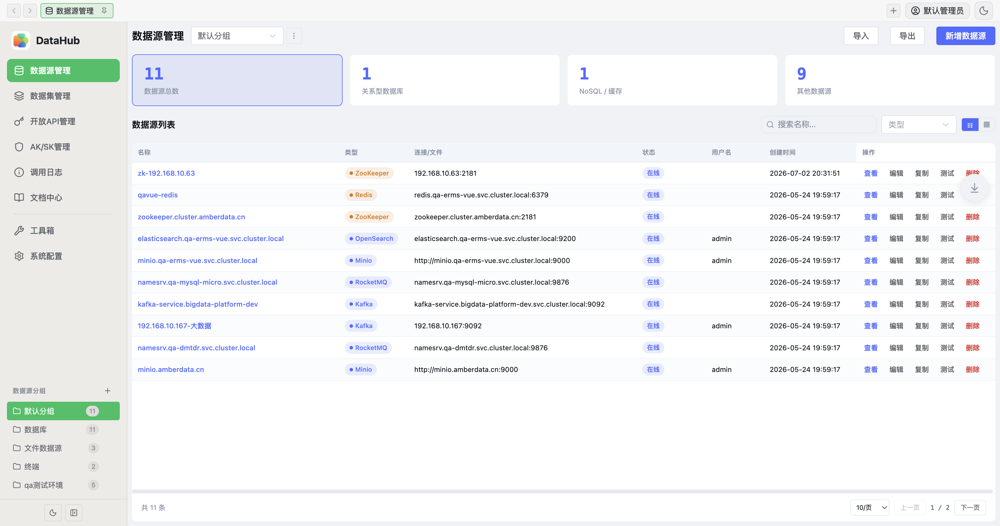
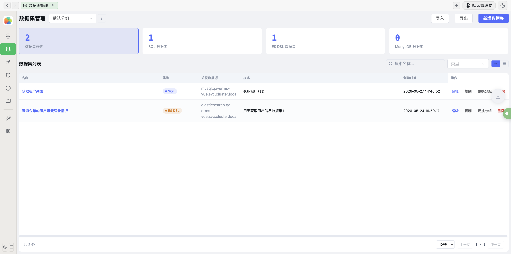
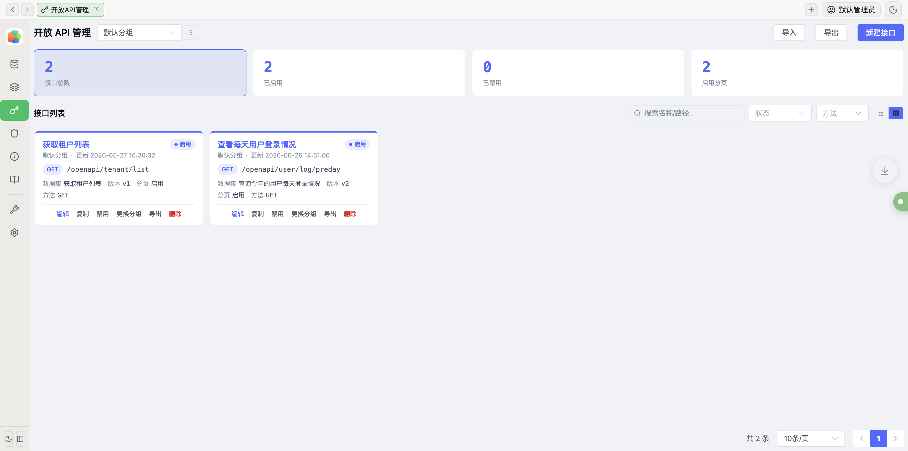
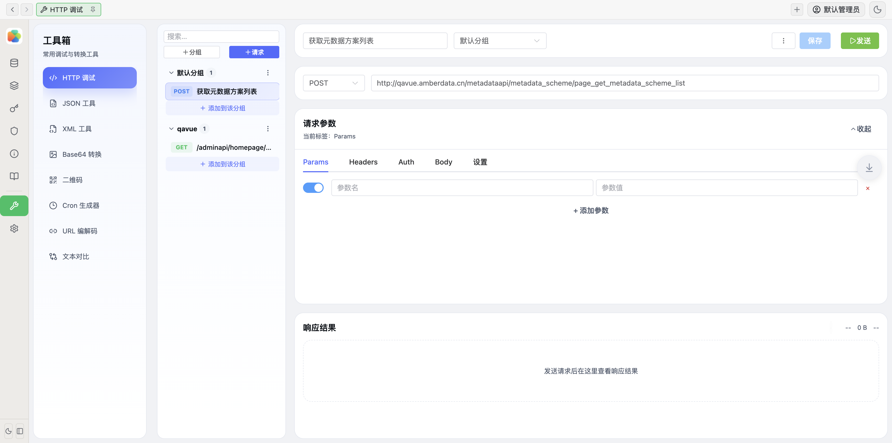
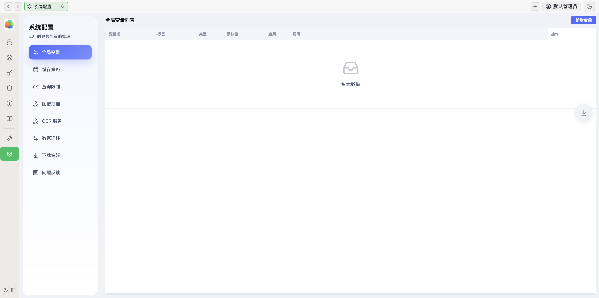
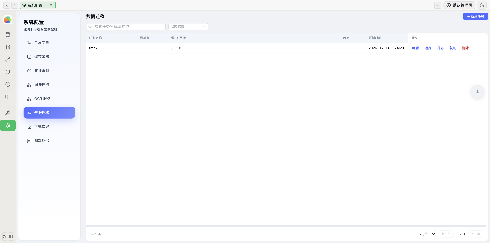
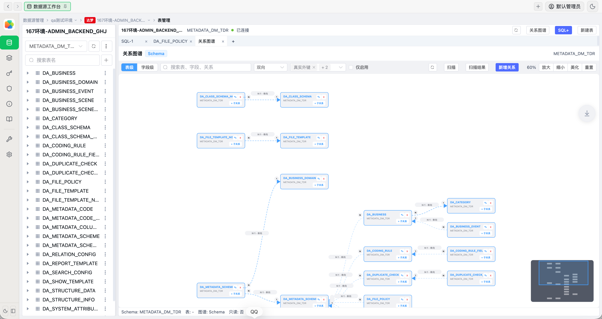
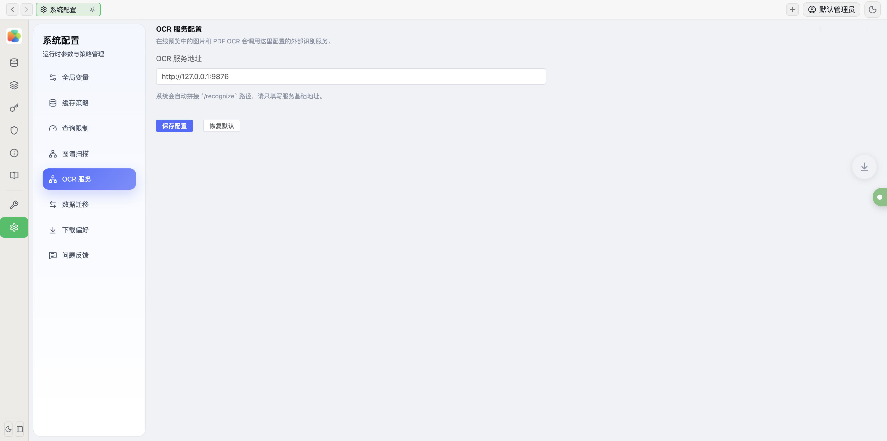
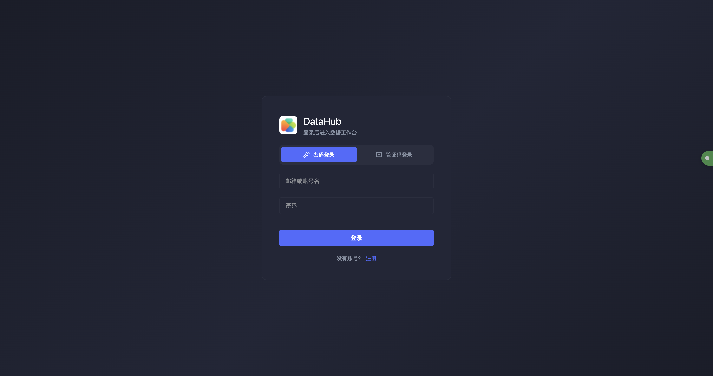
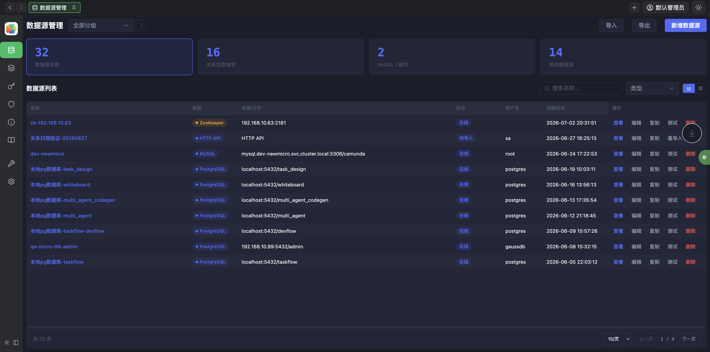

# DataHub 多数据源管理平台

**中文** | [English](README.en.md)

DataHub 是面向研发、数据、集成与运维团队的一体化数据接入与数据服务平台。它将多类型数据源管理、数据集建模、开放 API 发布、凭证治理、数据迁移、关系图谱、OCR 识别和开发工具箱整合到同一个工作台中，开箱即用、一键容器化部署，适合建设内部数据服务平台、数据中台工具和企业数据治理中心。

## 为什么选择 DataHub

- **一站式数据工作台** — 20+ 种数据源统一接入，无需在多个工具间切换，一个平台覆盖关系型数据库、NoSQL、搜索引擎、对象存储、消息中间件和文件传输。
- **从数据到 API 三步完成** — 接入数据源 → 创建数据集 → 发布开放 API，内置版本管理、AK/SK 凭证、限流和调用日志，省去自建网关的成本。
- **零门槛部署** — 提供 Docker 一键部署，内置 H2 嵌入式数据库，无需额外依赖即可快速启动；生产环境支持切换 PostgreSQL 获得更好的性能和可靠性。
- **多主题与多 Tab 工作台** — 支持明暗主题切换，多 Tab 页签并行操作多个数据源，提升研发和运维效率。
- **数据血缘与关系图谱** — 可视化展示数据源之间的关联关系，支持磁吸对齐、节点拖拽和数据预览，辅助数据治理决策。
- **企业级数据迁移** — 支持跨源数据迁移，提供表映射、字段映射、过滤条件、建表策略和执行日志，还可使用自定义 SQL 和数据集作为迁移源。
- **内置开发工具箱** — HTTP 调试、JSON/XML 格式化、Base64 转换、二维码生成、Cron 表达式、URL 编解码和文本 Diff，日常开发随手可用。
- **OCR 文字识别** — 集成 OCR 服务，支持图片文字识别，扩展数据采集能力。
- **多端交付** — 同时提供 Docker 容器部署和桌面客户端安装包（macOS / Windows），覆盖服务器、内网和离线场景。

## 界面预览

> 以下截图来自本地运行环境，展示数据已做匿名化处理。

| 数据源管理 | 数据集管理 |
| --- | --- |
|  |  |

| 开放 API 管理 | 工具箱 |
| --- | --- |
|  |  |

| 系统配置 | 数据迁移 |
| --- | --- |
|  |  |

| 关系图谱 | OCR 服务 |
| --- | --- |
|  |  |

| 登录页面 | 暗色主题 |
| --- | --- |
|  |  |

## 核心能力

| 模块 | 能力 |
| --- | --- |
| 数据源管理 | 分组管理、连接测试、类型化配置、专用工作台、导入导出、卡片/列表双视图 |
| 数据浏览 | 表结构浏览、SQL 编辑器、分页查询、DDL/DML 操作、数据复制、新建表 |
| 文件与 HTTP 导入 | Excel、CSV、HTTP API 预解析、镜像入库、重导入、进度跟踪 |
| 数据集管理 | SQL / ES DSL / Mongo Pipeline、字段映射、变量绑定、缓存 TTL、查询限制 |
| 开放 API | API 发布、版本管理、分页策略、OpenAPI / Markdown / Postman / curl 导出 |
| 凭证治理 | AK/SK 管理、凭证分组、有效期、IP 白名单、限流覆盖、调用统计 |
| 数据迁移 | 迁移任务、表映射、字段映射、过滤条件、建表策略、自定义 SQL 源、执行监控 |
| 关系图谱 | 数据血缘可视化、磁吸对齐、节点拖拽、数据预览、图谱扫描 |
| OCR 识别 | 图片文字识别、多引擎适配、服务配置 |
| 工具箱 | HTTP 调试、JSON、XML、Base64、二维码、Cron、URL、文本 Diff |
| 系统配置 | 全局变量、缓存策略、查询限制、图谱扫描、OCR 服务、下载偏好、问题反馈 |

## 支持的数据源

| 类型 | 数据源 |
| --- | --- |
| 关系型数据库 | MySQL、PostgreSQL、Oracle、达梦、人大金仓、GBase8s、Doris |
| NoSQL / 缓存 | Redis、MongoDB |
| 搜索引擎 | Elasticsearch、OpenSearch |
| 对象存储 | MinIO、阿里云 OSS、华为云 OBS、AWS S3 |
| 文件传输与协同 | FTP、SFTP、ZooKeeper |
| 消息中间件 | Kafka、RocketMQ |
| 导入型数据源 | Excel、CSV、HTTP API |

文件型和 HTTP 型数据源会先导入本地镜像库，再统一参与查询、数据集建模和 API 发布。

## 系统架构

```text
┌─────────────────────────────────────────────────────────────┐
│                         管理端 UI                            │
│        Vue 3 + TypeScript + Element Plus                    │
│              Web / 桌面客户端 / Docker                       │
└────────────────────────────┬────────────────────────────────┘
                             │ REST / SSE / WebSocket
┌────────────────────────────▼────────────────────────────────┐
│                     Spring Boot 服务层                       │
│  数据源接入 | 数据集编排 | API 发布 | 迁移引擎 | 图谱 | OCR   │
└───────────────┬──────────────┬──────────────┬───────────────┘
                │              │              │
        元数据存储        文件 / HTTP 镜像       外部业务数据源
      PostgreSQL / H2       本地存储            DB / ES / MQ / OSS
```

## 部署方式

### Docker 容器部署（推荐）

最快速的部署方式，无需安装任何依赖环境。

**1. 创建 `docker-compose.yml`**

```yaml
services:
  app:
    image: data-collect:latest
    ports:
      - "${APP_PORT:-8123}:8123"
    environment:
      SPRING_PROFILES_ACTIVE: embedded
      SERVER_PORT: 8123
      SPRING_DATASOURCE_URL: jdbc:h2:file:/app/data/datasource;AUTO_SERVER=TRUE;MODE=PostgreSQL;DATABASE_TO_LOWER=TRUE;INIT=CREATE SCHEMA IF NOT EXISTS PUBLIC\;CREATE DOMAIN IF NOT EXISTS JSONB AS JSON
      APP_STORAGE_PATH: /app/backend-data
      JAVA_OPTS: ${JAVA_OPTS:--Xms256m -Xmx512m}
    volumes:
      - h2-data:/app/data
      - app-data:/app/backend-data
    restart: unless-stopped

volumes:
  h2-data:
  app-data:
```

**2. 启动服务**

```bash
docker compose up -d
```

**3. 访问系统**

打开浏览器访问 `http://localhost:8123`，通过邮箱注册账号即可开始使用。

**4. 环境变量说明**

| 变量 | 默认值 | 说明 |
| --- | --- | --- |
| `APP_PORT` | `8123` | 宿主机映射端口 |
| `JAVA_OPTS` | `-Xms256m -Xmx512m` | JVM 内存参数 |

**5. 数据持久化**

Docker Compose 默认创建两个数据卷：

- `h2-data` — 元数据库文件，存储数据源配置、用户信息、数据集和 API 配置等
- `app-data` — 文件型数据源镜像存储（Excel、CSV、HTTP API 导入的数据）

**6. 停止与清理**

```bash
# 停止服务（保留数据）
docker compose down

# 停止并删除数据卷（清除所有数据）
docker compose down -v
```

### 桌面客户端安装

提供 macOS（DMG）和 Windows（MSI / EXE）安装包，内置运行时环境，双击即可运行，适用于离线和单机使用场景。

首次启动后通过邮箱注册账号。

## 注意事项

- 首次使用需要通过邮箱注册账号，登录支持密码和邮箱验证码两种方式。
- Docker 模式默认使用 H2 嵌入式数据库，生产环境建议切换为 PostgreSQL 以获得更好的并发性能。
- 桌面客户端使用本地 H2 文件库，数据保存在安装目录下，卸载前请注意备份。
